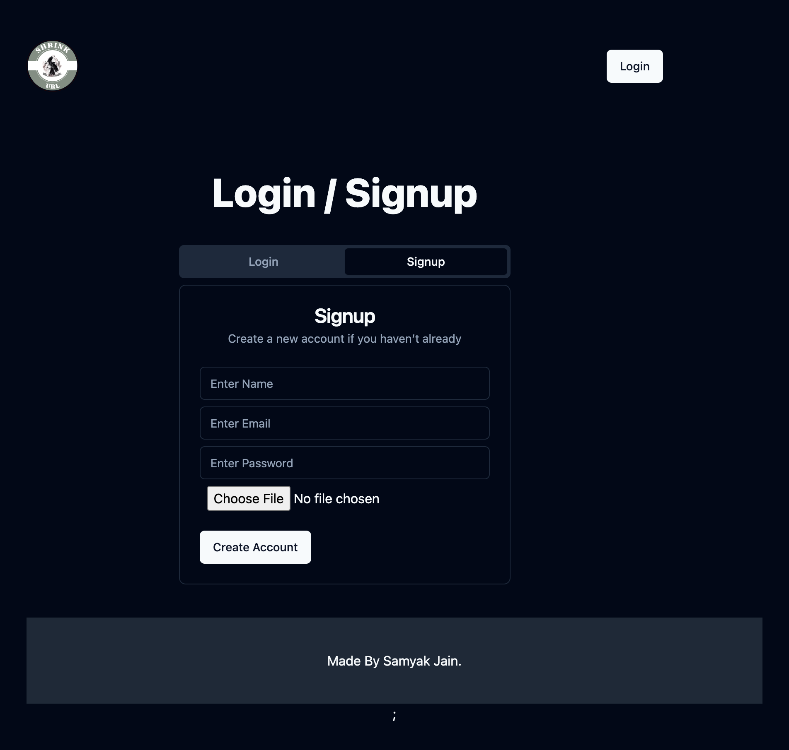
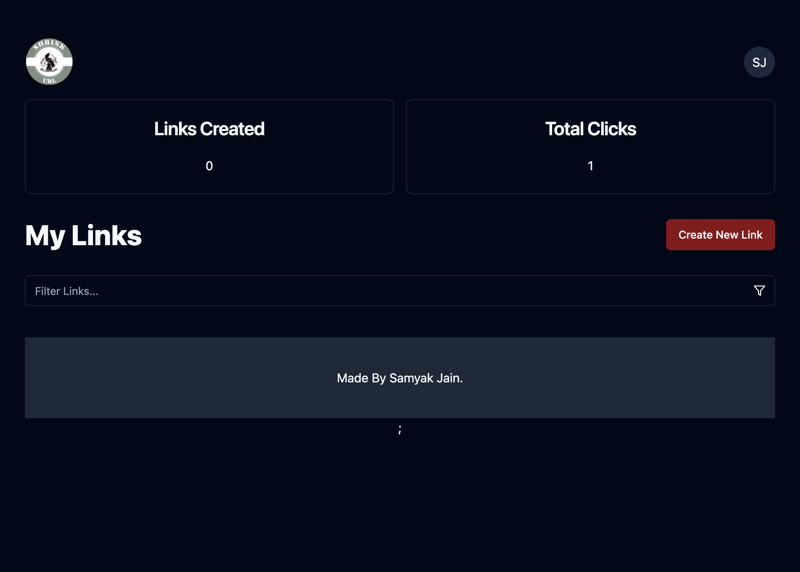
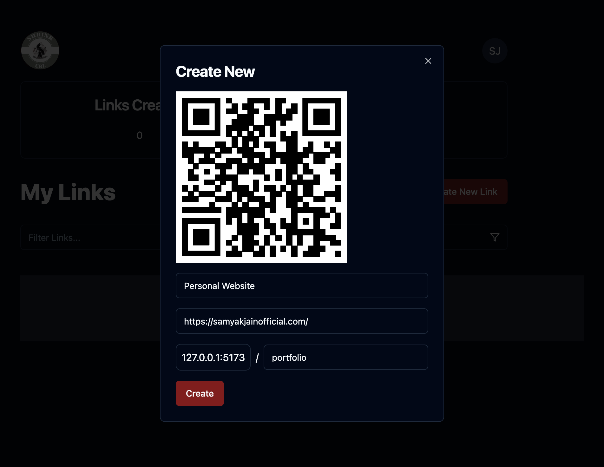
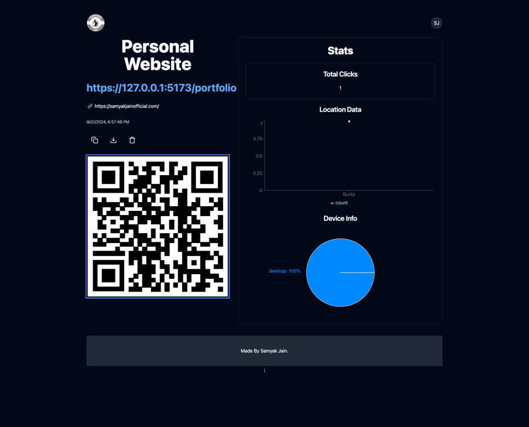

# ShrinkURL

**ShrinkURL** is a simple and efficient URL shortener web application built using ReactJS and ShadCN UI for the frontend. 
The app allows users to input long URLs and receive a shortened version for easy 
sharing. It also tracks statistics related to the usage of shortened URLs.

## Features

- **URL Shortening**: Converts long Urls into shorter, more shareable links
- **User Authentication**: Login and Signup functionality with form validation.
- **Dashboard**: Logged-in users can view their shortened URLs, track click statistics, and create custom links.
- **Analytics**: Track total clicks on each shortened link.
- **Customizable**: Users can create custom short URLs.
- **Clean UI**: Built using [ShadCN UI](https://ui.shadcn.com/docs) components for a modern, responsive interface.


## Tech Stack

- **Frontend**: ReactJS
- **UI Components**: ShadCN UI
- **Database**: Supabase (Used for managing user data and URL stats)
- **State Management**: React Context API for managing global states.
- **Styling**: TailwindCSS for utility-first CSS.

## Installation

To run this project locally, follow these steps:

1. Clone the repository:

```bash
git clone https://github.com/your-username/url-shortener.git
cd url-shortener
````

2.  Install Dependencies
```bash
npm install
```

3.  Set Up environment variables: <br>
Create a .env file in the root directory with the following details (modify as per your requirements):
```bash
VITE_SUPABASE_KEY= <your-supabase-key>
VITE_SUPABASE_URL=<your-supabase-URL>
```
## Screenshots


*Homepage where users can shorten their long URLs*


*Login and Signup Page*


*User dashboard displaying shortened URLs and click statistics*


*Create New Link*


*Analytics page when Link is generated*
